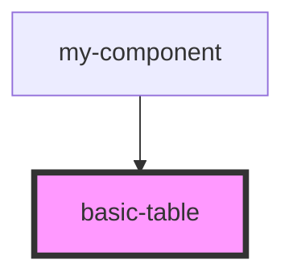

# basic-table

<!-- Auto Generated Below -->

## Properties

| Property      | Attribute      | Description | Type  | Default |
| ------------- | -------------- | ----------- | ----- | ------- |
| `tableData`   | `table-data`   |             | `any` | `[]`    |
| `tableHeader` | `table-header` |             | `any` | `[]`    |

## Dependencies

### Used by

 - [my-component](../my-component)

### Graph

----------------------------------------------

*Built with [StencilJS](https://stenciljs.com/)*
