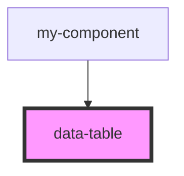

# data-table

<!-- Auto Generated Below -->

## Properties

| Property    | Attribute    | Description | Type     | Default     |
| ----------- | ------------ | ----------- | -------- | ----------- |
| `data`      | `data`       |             | `string` | `undefined` |
| `header`    | `header`     |             | `string` | `undefined` |
| `pageLimit` | `page-limit` |             | `number` | `5`         |

## Dependencies

### Used by

 - [my-component](../my-component)

### Graph

----------------------------------------------

*Built with [StencilJS](https://stenciljs.com/)*
