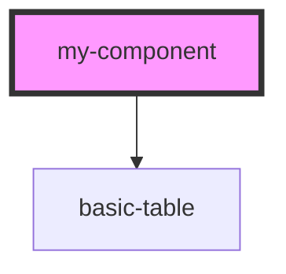

# my-component

<!-- Auto Generated Below -->

## Properties

| Property       | Attribute | Description     | Type                                           | Default                                                                                                                                                                                                                                                                                                                                                                                                                                                                                                                                                                                                                                                                 |
| -------------- | --------- | --------------- | ---------------------------------------------- | ----------------------------------------------------------------------------------------------------------------------------------------------------------------------------------------------------------------------------------------------------------------------------------------------------------------------------------------------------------------------------------------------------------------------------------------------------------------------------------------------------------------------------------------------------------------------------------------------------------------------------------------------------------------------- |
| `columnHeader` | --        |                 | `{ label: string; key: string; }[]`            | `[     { label: 'Name', key: 'name' },     { label: 'Age', key: 'age' },   ]`                                                                                                                                                                                                                                                                                                                                                                                                                                                                                                                                                                                           |
| `data`         | --        |                 | `{ name: string; age: number; id: number; }[]` | `[     { name: 'kaleeswaran', age: 22, id: 1 },     { name: 'Sundari', age: 21, id: 2 },     { name: 'Mani', age: 24, id: 3 },     { name: 'Saravanakumar', age: 22, id: 4 },     { name: 'Nandhini', age: 31, id: 5 },     { name: 'Porkodi', age: 54, id: 6 },     { name: 'Mariappan', age: 62, id: 7 },     { name: 'Pechiyammal', age: 28, id: 8 },     { name: 'Muthumanikkam', age: 29, id: 9 },     { name: 'Suresh', age: 29, id: 10 },     { name: 'Nithilan', age: 2, id: 11 },     { name: 'Niranjan', age: 4, id: 12 },     { name: 'Sahana', age: 2, id: 13 },     { name: 'ArjunRam', age: 1, id: 14 },     { name: 'MuthuMani', age: 24, id: 15 },   ]` |
| `first`        | `first`   | The first name  | `string`                                       | `undefined`                                                                                                                                                                                                                                                                                                                                                                                                                                                                                                                                                                                                                                                             |
| `last`         | `last`    | The last name   | `string`                                       | `undefined`                                                                                                                                                                                                                                                                                                                                                                                                                                                                                                                                                                                                                                                             |
| `middle`       | `middle`  | The middle name | `string`                                       | `undefined`                                                                                                                                                                                                                                                                                                                                                                                                                                                                                                                                                                                                                                                             |

## Dependencies

### Depends on

- [basic-table](../basic-table)

### Graph

----------------------------------------------

*Built with [StencilJS](https://stenciljs.com/)*
