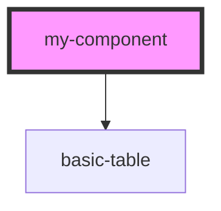

# my-component

<!-- Auto Generated Below -->

## Properties

| Property       | Attribute | Description     | Type                                           | Default                                                                                                             |
| -------------- | --------- | --------------- | ---------------------------------------------- | ------------------------------------------------------------------------------------------------------------------- |
| `columnHeader` | --        |                 | `{ label: string; key: string; }[]`            | `[{label: "Name", key: 'name'},{label: "Age", key: 'age'}]`                                                         |
| `data`         | --        |                 | `{ name: string; age: number; id: number; }[]` | `[     {name: "kaleeswaran", age:22,id:1},     {name: "Sundari", age:21,id:2},     {name: "Mani", age:24,id:3}   ]` |
| `first`        | `first`   | The first name  | `string`                                       | `undefined`                                                                                                         |
| `last`         | `last`    | The last name   | `string`                                       | `undefined`                                                                                                         |
| `middle`       | `middle`  | The middle name | `string`                                       | `undefined`                                                                                                         |

## Dependencies

### Depends on

- [basic-table](../basic-table)

### Graph

----------------------------------------------

*Built with [StencilJS](https://stenciljs.com/)*
